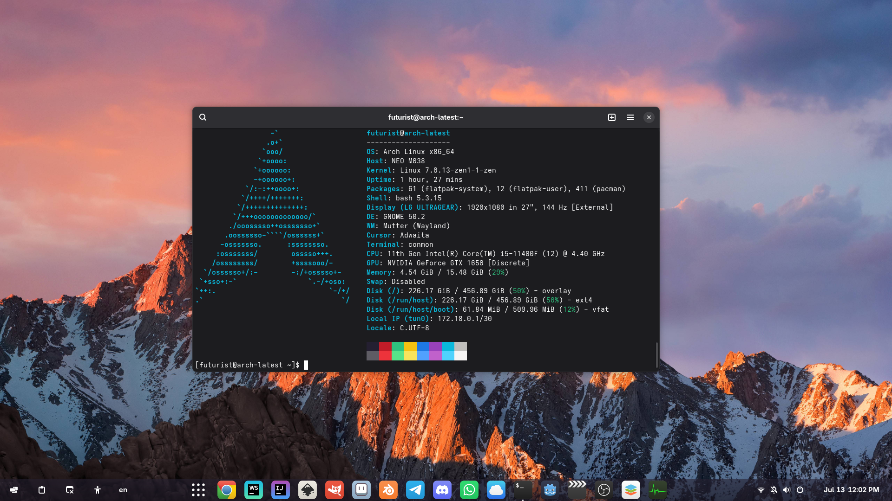
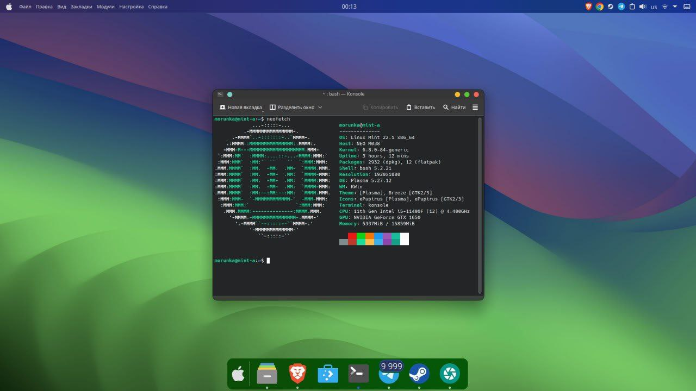
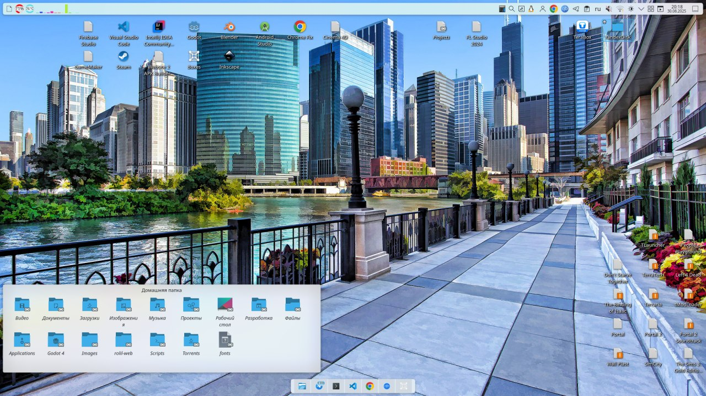
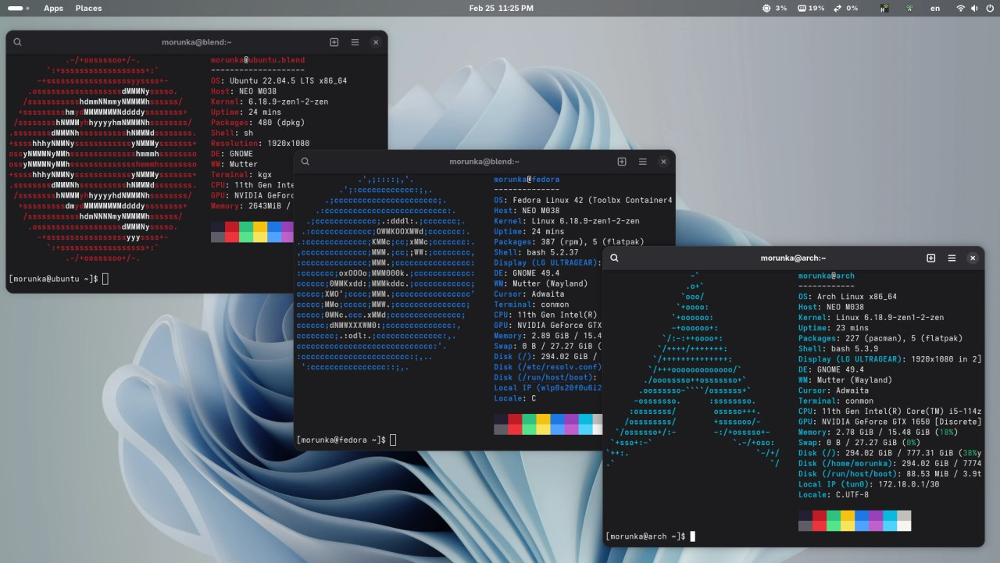

# 🐧 Grazy's Linux (BlendOS Configuration & Dotfiles)

Мой персональный конфигурационный репозиторий для **blendOS** (Gnome Edition). Здесь собраны актуальные системные треки, списки используемых пакетов (включая AUR), конфигурации расширений рабочего стола и коллекция кастомных обоев.

Помимо поддержки собственной сборки, я профессионально занимаюсь **дизайном и глубокой настройкой Linux-окружений** (DE). Если вы хотите превратить свой рабочий стол в функциональное произведение искусства — мои контакты внизу страницы.

## 🖥 Текущее рабочее окружение (blendOS + Gnome)


---

## 💻 Спецификация текущего окружения

* **OS:** blendOS (на базе Arch Linux)
* **DE:** GNOME (Track: `default-gnome`)
* **Визуальный стиль:** Прозрачная тема `materia-transparent-gtk-theme-git` и иконки `mint-y-icons`.

---

## 🎨 Шоукейс моих прошлых дизайнов (Портфолио)

Я создаю уникальные интерфейсы на базе различных графических оболочек под любые задачи:

### 🍏 Cinnamon — macOS Style Сборка
Чистая трансформация интерфейса в стиле macOS: верхняя глобальная панель, скругленный нижний док с иконками приложений, перенос элементов управления окнами и чистая эстетика Apple.


### 📊 KDE Plasma — Плиточный & Информативный сетап
Создание сложных многофункциональных панелей, интеграция виджетов системного мониторинга (загрузка дисков, памяти, датчики температур), кастомные доки и глубокая настройка размытия элементов.


### 💻 GNOME — Минималистичный гибрид
Кастомизация с помощью расширений (Dash to Panel, Blur my Shell) для сборки строгого, но отзывчивого интерфейса с полуавтоматическим тайлингом окон для удобной разработки.


---

## 🗺 Мой путь в мире Linux (Личная одиссея)

Мое знакомство с открытыми системами началось с радикального шага. До этого я сидел на **Windows 10**, к которой сейчас испытываю стойкое отторжение: плиточный дизайн, отсутствие базового терминала и архиватора из коробки, а также общая закрытость системы вызывают искреннее недоумение после гибкости Linux. 

Моя хронология дистрибутивов и реальный опыт эксплуатации выглядят так:

1. **Windows 10 ➡️ Linux Mint (Виртуальная машина):** Первые тесты. Дефолтный Cinnamon вызвал у меня эстетический шок и отторжение, из-за чего полноценно на ПК я его ставить не стал.
2. **Arch Linux (KDE):** Моя самая первая реальная система на железе. Мы с друг ставили её вручную по гайдам с YouTube в эпоху, когда утилиты `archinstall` еще не существовало в природе. Из-за ошибок ручной сборки система вела себя странно: дефолтные иконки Breeze сбрасывались после перезагрузки, Chromium-браузеры ломали рамки окон, а кастомизация KDE намертво вылетала с ошибками.
3. **Linux Mint (KDE / macOS style):** Перешел ради хваленой стабильности «для новичков». Здесь я снес Cinnamon, накатил KDE и впервые воссоздал интерфейс в стиле macOS. Это был мой первый успешный опыт кастомизации. Однако система стала запускаться невыносимо долго — как выяснилось позже, из-за тяжелого и багованного `latte-dock` (который я теперь обхожу стороной).
4. **Ubuntu (GNOME):** Попытка найти более отзывчивый дистрибутив без долгого старта. 
5. **EndeavourOS (KDE):** Отличная система в плане работы драйверов Nvidia и игр, но прошедшая через 5–6 полных переустановок. Когда я поступил на первый курс техникума, мне приходилось выполнять много студенческих и учебных работ. Необходимость переустанавливать ОС каждые две недели ради возвращения стабильности после очередных обновлений стала последней каплей.
6. **BlendOS (Текущая рабочая система):** Устав от постоянных поломок, я потратил целую неделю выходных на непрерывный поиск и тестирование систем. Итогом стал идеальный сетап.

### 🎮 Мой текущий Dual-Boot сетап:
Чтобы полностью разграничить задачи и забыть о проблемах со стабильностью, сейчас я использую две независимые системы:
* **BlendOS** — неизменяемая, неубиваемая базовая система на каждый день для учебы, работы и бэкенд-разработки.
* **Arch Linux** — развернут на отдельном NVMe SSD объемом 1 ТБ, выделен исключительно под Steam, игры и тяжелую графику, где драйверы Nvidia могут развернуться на полную мощность.

---

## 🧪 Дистрибутивный тест-драйв & Облачный Архив
В процессе поиска идеала мной было протестировано более 20+ дистрибутивов. Среди них: **Pop!_OS** (где я нашел окружение Cosmic крайне неудобным по сравнению с классическим Gnome), **MX Linux**, **openSUSE** (где я за 5 минут развернул Mac-тему, но словил критические трейсбеги инсталлятора), а также **Zorin OS**, **Nobara** и **CachyOS** (последние два не завелись из-за конфликтов оборудования и крашей на этапе развертывания).

📦 Вы можете получить доступ к моей личной коллекции дистрибутивов в [Облачном архиве ISO-образов на Яндекс.Диске](https://disk.yandex.ru/d/deWoOZFGQl9EkA).

---

## 📦 Основной системный конфиг blendOS (`system.yaml`)

Мой декларативный файл конфигурации blendOS, расположенный в корневой файловой системе, предназначенный для управления репозиториями, драйверами, пакетами и системными службами:

```yaml
arch-repo: https://geo.mirror.pkgbuild.com
impl: https://github.com/blend-os/tracks/raw/main
repo: https://pkg-repo.blendos.co
track: default-gnome

packages:
  - nvidia-dkms
  - nvidia-prime
  - switcheroo-control
  - flatpak
  - postgresql
  - micro
  - gparted

aur-packages:
  - mint-y-icons
  - happ
  - clash-verge
  - materia-transparent-gtk-theme-git

services:
  - switcheroo-control
  - postgresql

commands: "sudo rm -rf /usr/share/sounds/freedesktop"
```

---

## 🧩 Активные расширения GNOME

* **Dash to Panel** — объединение верхней панели и дока в единый настраиваемый таскбар.
* **Blur my Shell** — красивое размытие элементов интерфейса Gnome.
* **O-tiling** — удобный полуавтоматический тайлинг окон.
* **V-Shell** — кастомизация экрана обзора (Overview) и вертикальных рабочих столов.
* **Clipboard Indicator** — менеджер истории буфера обмена.
* **Force Quit** — быстрая принудительная остановка зависших процессов.
* **Apps Menu** — классическое меню категорий приложений.

---

## ⚙️ Как применить эти настройки?

### 1. Системный конфиг blendOS
Для применения системной конфигурации скопируйте файл `system.yaml` из этого репозитория в корень вашей файловой системы:
```bash
sudo cp system.yaml /system.yaml
```

### 2. Экспорт/Импорт настроек расширений (dconf)
Чтобы не настраивать расширения вручную, используйте утилиту `dconf`.

* **Как сделать бэкап настроек:**
  ```bash
  mkdir -p ~/.config/gnome-extensions/
  dconf dump /org/gnome/shell/extensions/ > ~/.config/gnome-extensions/extensions.dconf
  ```

* **Как восстановить настройки на чистой системе:**
  ```bash
  dconf load /org/gnome/shell/extensions/ < .config/gnome-extensions/extensions.dconf
  ```

---

## 🖼 Галерея обоев
Все используемые мной фоны рабочего стола (включая стартовые горы на закате) бережно хранятся в папке `wallpapers/`.

---

## 💬 Заказ дизайна и кастомизации
Если вам понравились мои работы и вы хотите заказать индивидуальную настройку, стилизацию или оптимизацию вашей Linux-системы под конкретные задачи — пишите мне напрямую.

[](https://t.me/MEOW_MUR920)
[](https://github.com/grazywhat)
